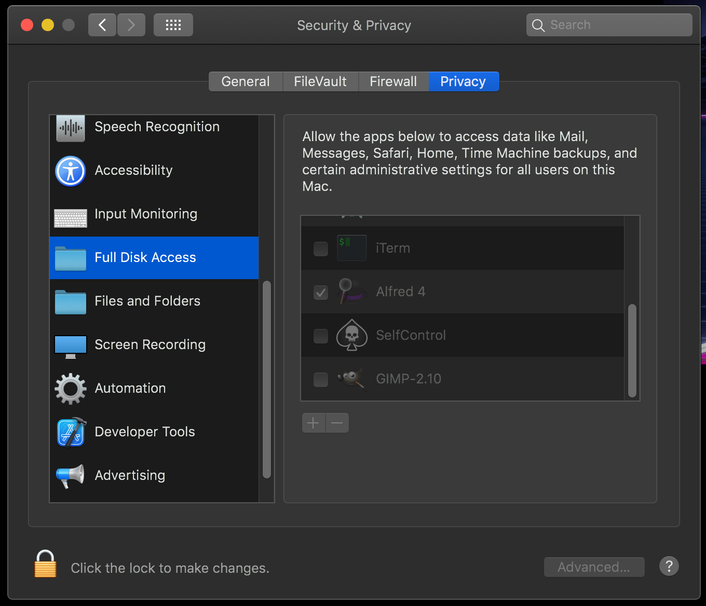

  
   
   
  

    <b>ch - Super fast Alfred 3+ workflow to search through Chrome history 🕵️‍♀️</b>
  

  

      <i>Helps you to search through Chrome history faster, saving precious time</i>
  

  

  

  

    Built with ❤︎ by
      <a href="https://github.com/gigantik">gigantik</a>
    
  

    

Download & installation
-----------------------

Grab the workflow from GitHub repository. Download the <a href="ch - Chrome History Fuzzy Search.alfredworkflow">ch - Chrome History Fuzzy Search.alfredworkflow</a> file and double-click it to install.

Prerequisites
-----

You need to permit Alfred full disk access since copying Chrome history db file to `/tmp/h` is needed!

Usage
-----

If you are signed into Chrome, you will need to change `/Chrome/Default/`, to
`/Chrome/Profile\ 1/`, (take a look inside `~/Library/Application\
Support/Google/Chrome` to find your Profile number.

- `ch [<query>]` — Search and open recent history

